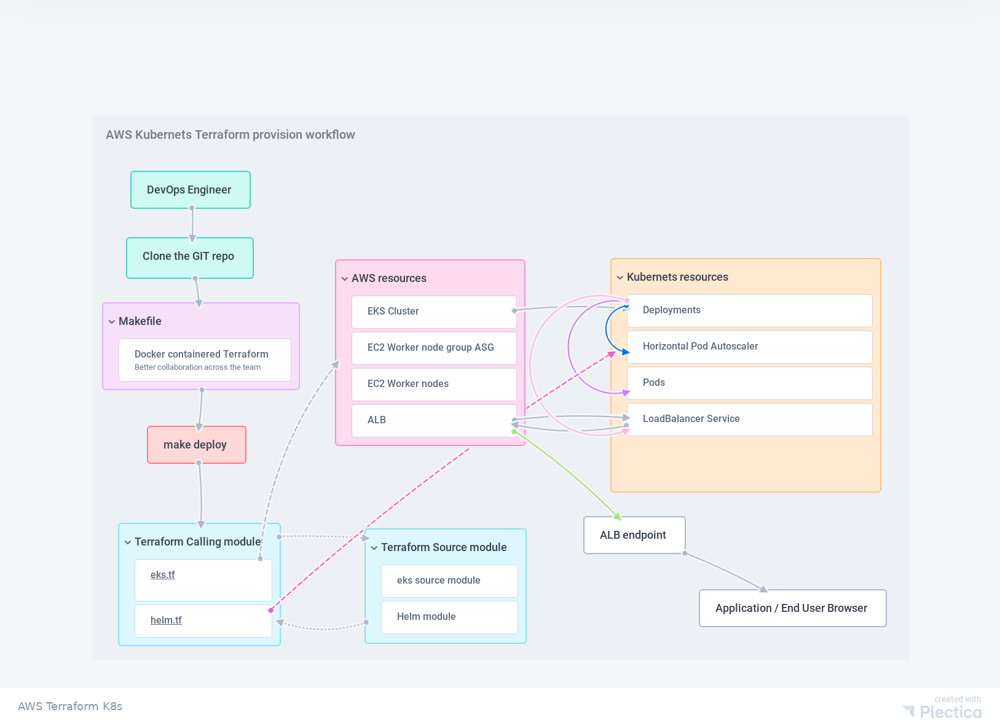

## AWS Kubernets provision using Terraform 


------

- NodeJS service has been converted as a microservice to fit Kubernets artchitecture
- Terraform has been converted as docker container microservice for better collabration by using the same version of terraform across the team.
- Makefile has been used in this project for automation and provsion the entire stack with a single command. 
- Load and perfomance testing tool called locust has been converted as a docker container for ease of use. 

## Prerequisite
- AWS account access
- AWS iam programmatic user access with the follwing policy attached to the user
- AmazonEC2FullAccess,IAMFullAccess,AutoScalingFullAccess,AmazonEKSClusterPolicy,     
- AmazonEKSWorkerNodePolicy,AmazonVPCFullAccess,AmazonEKSServicePolicy,AmazonEKS_CNI_Policy

---
## How to provision the infra
Makefile has been leveraged for the simple approach towards the one click entire stack deployement. 

- GIT Clone this repo
- Configure your AWS credentials. 
- Just deploy the entire stack by for following single command. 
```
make deploy
```
- Review the resources and type yes.
- Detailed workflow has been given on the follwing diagram. 

## Workflow diagram. 
 

------

---

## Architecture. 
 

## How to see the application and access the kubernetes cluster. 

- If you are running the ```make deploy``` inside laptop/ aws instance. The kubernets kubeconfig will be posted on the same directory. You can make use of this kubeconfig if you are using any K8s tools like lens or any other k8s IDE. 
- Other way to access the k8s cluster via kubectl. 
- set the context by following command after ```make deploy``` 
- ```aws eks --region $(terraform output -raw region) update-kubeconfig --name $(terraform output -raw cluster_name)```
- Above command will set the context to use the kubectl. 
- Now ALB url will be avilable by ```kubectl get svc``` or go the AWS ALB console and copy and use it on any browser. 
```
[ec2-user@ip-172-31-83-136 aws-terraform-nodejs]$ kubectl get svc
NAME                              TYPE           CLUSTER-IP     EXTERNAL-IP                                                              PORT(S)        AGE
nodejsapplication-helm-nodejs     LoadBalancer   172.20.83.16   a0a551a21584c449a961842a873b38c6-718686509.us-east-1.elb.amazonaws.com   80:31924/TCP   18m
```
- The port 80 for the NodeJS application is open on the internet.  

## How fault tolerance with high availability acheived
- K8s resource are deployed as a deployment and mapped to Horizontal Pod Autoscaler.
- HPA will look after the pods memory and cpu utilization and it will increase the pods count and decrease the pod count if the load pressure coming under control.  
- K8s worker nodes are deployed are AWS Auto Scalling Group.   

## Performance Testing / Load Testing.  
- use the following command to do perfomance / load testing. 


```
# export TARGET_HOST=Place-your-ALB-URL-Here

# docker run -i --rm -v $PWD/reports:/opt/reports -v ~/.aws:/root/.aws -v $PWD/:/opt/script -v $PWD/credentials:/meta/credentials -p 8089:8089 -e ROLE=standalone -e TARGET_HOST=$TARGET_HOST -e LOCUST_FILE=https://raw.githubusercontent.com/zalando-incubator/docker-locust/master/example/simple.py -e SLAVE_MUL=4 -e AUTOMATIC=False registry.opensource.zalan.do/tip/docker-locust
```

- open your local browser and use localhost:8089 (The IP varies Depends on where you are running the above docker command)
- Give the user and load iteration above 1000 concurrent users to generate the load. 
- Monitor the pods counts and HPA as per the load the pods count will be increased via hpa component. 


## Application lifecycle Management with zero downtime. 

- Make sure to do the code change for the Nodejs app given on this same directory. 
- Do docker build and push it to the Docker registry
- Once we have the latest image avilable create a branch from this repositary
- append new image tag on the NodeJS helm chart values.yaml file. 
- Creat a PR
- Apply the change by running terraform ```make deploy```
- Deployment will be performed by Helm. The K8s deployment will take care of rolling update on the pods to acheive zero downtime.  

## Enhancement 
- The whole orchestration can be performed via Jenkins as a scripted/Declatrative pipeline
- Helm chart can be packaged and placed in a seperate registry which will give more leverage for our App lifecycle management. 
- GitOps model can be implemented as via the branch build and PR's terraform can be posted on the PR itself via GitHook from Jenkins slave to Git PR. Once approved promotion and apply part can be done via the pipeline. 