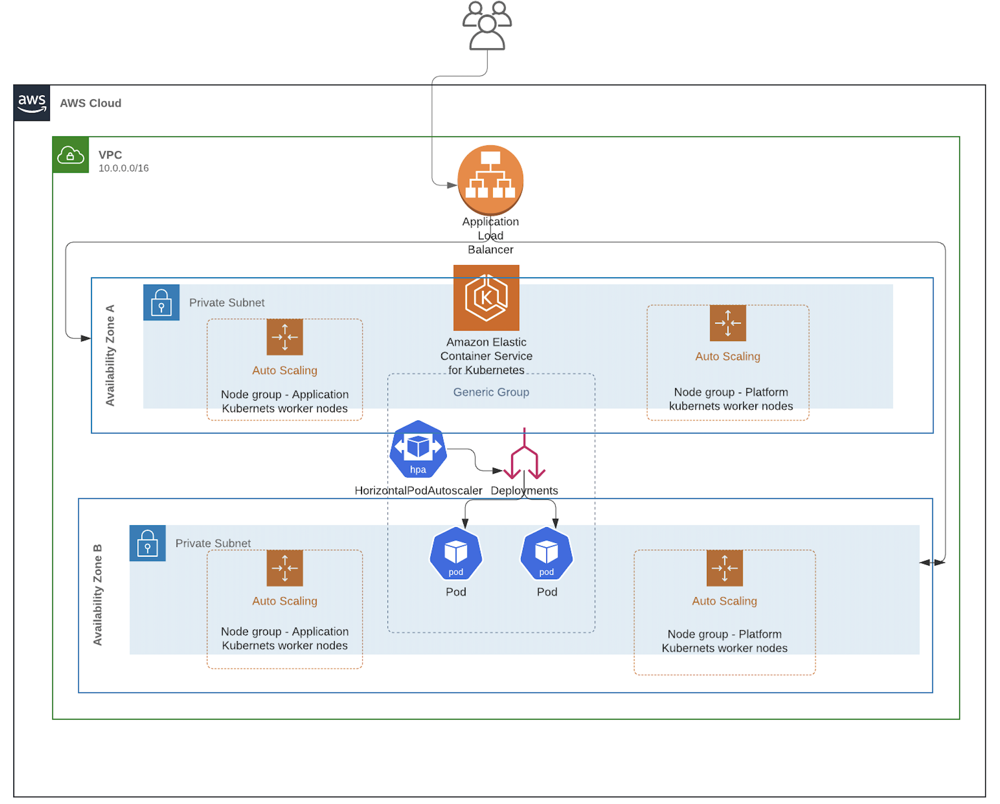

# AWS EKS Infrastructure as Code

Complete Kubernetes infrastructure provisioning on AWS using Terraform, with automated deployment, GitOps capabilities, and high availability.

## Overview

This project provides a production-ready AWS EKS cluster with:
- **Infrastructure as Code**: Terraform-based provisioning with Docker containerization for consistency
- **GitOps**: ArgoCD integration with app-of-apps pattern for automated platform toolkit deployment
- **Platform Services**: Monitoring (Prometheus/Grafana), Logging (Loki/Promtail), Microservices Demo, and Testing Tools
- **High Availability**: Auto-scaling worker nodes and Horizontal Pod Autoscaler (HPA)
- **Load Testing**: Integrated Locust container for performance testing
- **One-Command Deployment**: Makefile automation for entire stack provisioning

## Architecture



## Workflow


<details>
<summary><b>Prerequisites</b></summary>

### AWS Account Setup
- AWS account with programmatic access
- IAM user with the following policies attached:
  - `AmazonEC2FullAccess`
  - `IAMFullAccess`
  - `AutoScalingFullAccess`
  - `AmazonEKSClusterPolicy`
  - `AmazonEKSWorkerNodePolicy`
  - `AmazonVPCFullAccess`
  - `AmazonEKSServicePolicy`
  - `AmazonEKS_CNI_Policy`

### Local Requirements
- Docker installed and running
- AWS CLI configured with credentials (`~/.aws/credentials` or `AWS_PROFILE` environment variable)
- Git

</details>

<details>
<summary><b>Quick Start</b></summary>

## Quick Start

### 1. Clone Repository
```bash
git clone <repository-url>
cd k8s-infrastructure-as-code
```

### 2. Configure AWS Credentials
Ensure your AWS credentials are configured:
```bash
aws configure
# OR set AWS_PROFILE environment variable
export AWS_PROFILE=your-profile
```

### 3. Deploy Infrastructure
```bash
make deploy
```

Review the Terraform plan and type `yes` to proceed. The deployment includes:
- VPC and networking components
- EKS cluster with managed node groups
- Metrics Server for HPA
- NodeJS application (via Helm)
- ArgoCD for GitOps

### 4. Access Information
After deployment, the following information will be displayed:
- Kubernetes cluster access command
- ArgoCD server URL, username, and password

</details>

<details>
<summary><b>Accessing the Cluster</b></summary>

## Accessing the Cluster

### Kubernetes Access

**Option 1: Using kubectl**
```bash
aws eks --region $(terraform output -raw region) update-kubeconfig --name $(terraform output -raw cluster_name)
```

**Option 2: Using kubeconfig file**
If running `make deploy` locally, a `kubeconfig.yaml` file will be created in the project directory. Use this with Kubernetes tools like Lens, k9s, or other IDEs.

### Application Access

To access applications deployed via ArgoCD, check the service addresses for ArgoCD-managed applications:

```bash
# View all services across all namespaces (filter for LoadBalancer type)
kubectl get svc --all-namespaces -o wide | grep LoadBalancer

# Or check services in specific namespaces where ArgoCD applications are deployed
kubectl get svc -A | grep LoadBalancer
```

Example output showing LoadBalancer services:
```
NAMESPACE         NAME                           TYPE           CLUSTER-IP      EXTERNAL-IP                                                                    PORT(S)                      AGE
argocd            argocd-server                  LoadBalancer   172.20.31.45    ae0a1b0943bde47c888b7572a6ad45c2-249158737.us-east-1.elb.amazonaws.com    80:31294/TCP,443:31981/TCP   169m
availability-test availability-test-loadbalancer LoadBalancer   172.20.35.207   ae403df74e512450ea12f87c331e6085-1653404531.us-east-1.elb.amazonaws.com   80:30817/TCP                 65m
default           nodejsapplication-helm-nodejs  LoadBalancer   172.20.150.78   a94f29bc14896464ba71c4a6b0268926-1596390759.us-east-1.elb.amazonaws.com   80:31620/TCP                 169m
monitoring        grafana-external               LoadBalancer   172.20.239.192  a238680464cc84189b0e1e3384808532-2046907923.us-east-1.elb.amazonaws.com   80:31157/TCP                 65m
monitoring        prometheus-external            LoadBalancer   172.20.46.218   aebbefc85d572473dbf49278a582e551-909573805.us-east-1.elb.amazonaws.com    80:31512/TCP                 65m
online-boutique    frontend-external              LoadBalancer   172.20.45.188   a940897764ee141e78f0c1b4285ddbe0-44534569.us-east-1.elb.amazonaws.com     80:30369/TCP                 66m
sanity-test       sanity-test-loadbalancer       LoadBalancer   172.20.16.90    ae85a9abf3c3242ee9877286b30915e5-326690589.us-east-1.elb.amazonaws.com    80:31649/TCP                 66m
```

**Available Services:**
- **ArgoCD Server** (`argocd` namespace): GitOps UI and API (ports 80/443)
- **NodeJS Application** (`default` namespace): Main application (port 80)
- **Grafana** (`monitoring` namespace): Monitoring dashboards (port 80)
- **Prometheus** (`monitoring` namespace): Metrics collection (port 80)
- **Microservices Demo Frontend** (`online-boutique` namespace): Demo application (port 80)
- **Availability Test** (`availability-test` namespace): Testing service (port 80)
- **Sanity Test** (`sanity-test` namespace): Health check service (port 80)

Applications are accessible via their respective LoadBalancer URLs. You can also view service details in the ArgoCD UI for each application.

### ArgoCD Access

ArgoCD is deployed with a LoadBalancer service. Access information is displayed after `make deploy`:
- **URL**: Provided in deployment output
- **Username**: `admin`
- **Password**: Generated automatically (displayed in output)

#### App-of-Apps Pattern

The infrastructure includes an app-of-apps configuration (`argocd/app-of-apps.yaml`) that automatically deploys a comprehensive platform toolkit from the [k8s-platform-toolkit](https://github.com/Lforlinux/k8s-platform-toolkit.git) repository. 

**k8s-platform-toolkit** is the main platform toolkit application (parent app-of-apps) that manages all other applications. For detailed information about all applications, their configurations, and usage, please refer to the [k8s-platform-toolkit repository](https://github.com/Lforlinux/k8s-platform-toolkit.git).

The following applications are automatically deployed:

- **k8s-platform-toolkit**: Main platform toolkit application (parent app-of-apps)
- **monitoring-stack**: Prometheus and Grafana for metrics and monitoring
- **loki-stack**: Centralized logging stack with Loki
- **promtail**: Log shipper for collecting and sending logs to Loki
- **microservices-demo**: Demo microservices application
- **availability-test**: Application availability testing
- **sanity-test**: Cluster sanity and health checks

The app-of-apps pattern uses automated sync with self-healing and pruning enabled, ensuring all platform applications are automatically deployed and maintained via GitOps workflows.

To view all deployed applications and their status:
```bash
kubectl get applications -n argocd
```

</details>

<details>
<summary><b>High Availability & Fault Tolerance</b></summary>

## High Availability & Fault Tolerance

### Horizontal Pod Autoscaler (HPA)
- Automatically scales pods based on CPU and memory utilization
- Increases pod count under load pressure
- Decreases pod count when load normalizes
- Requires Metrics Server (deployed automatically)

### Worker Node Auto Scaling
- EKS worker nodes are deployed in AWS Auto Scaling Groups
- Automatically scales nodes based on cluster demand
- Ensures sufficient capacity for pod scheduling

</details>

<details>
<summary><b>Performance Testing</b></summary>

## Performance Testing

Load testing can be performed using the Locust container:

```bash
export TARGET_HOST=<your-alb-url>

docker run -i --rm \
  -v $PWD/reports:/opt/reports \
  -v ~/.aws:/root/.aws \
  -v $PWD/:/opt/script \
  -v $PWD/credentials:/meta/credentials \
  -p 8089:8089 \
  -e ROLE=standalone \
  -e TARGET_HOST=$TARGET_HOST \
  -e LOCUST_FILE=https://raw.githubusercontent.com/zalando-incubator/docker-locust/master/example/simple.py \
  -e SLAVE_MUL=4 \
  -e AUTOMATIC=False \
  registry.opensource.zalan.do/tip/docker-locust
```

1. Open `http://localhost:8089` in your browser
2. Configure load test parameters (recommended: 1000+ concurrent users)
3. Monitor pod scaling via HPA:
   ```bash
   kubectl get hpa
   kubectl get pods -w
   ```

</details>

<details>
<summary><b>Application Lifecycle Management</b></summary>

## Application Lifecycle Management

### Zero-Downtime Deployments

The infrastructure supports zero-downtime deployments through Kubernetes rolling updates:

1. **Update Application Code**
   - Make changes to the NodeJS application in `Nodejs-Docker/`
   - Build and push Docker image to your registry

2. **Update Helm Chart**
   - Create a feature branch
   - Update image tag in `charts/helm-nodejs-app/values.yaml`
   - Create a Pull Request

3. **Deploy Changes**
   ```bash
   make deploy
   ```
   - Helm performs rolling updates
   - Kubernetes ensures zero downtime during deployment

### GitOps Workflow (ArgoCD)

For GitOps-based deployments:
1. Push application manifests to Git repository
2. ArgoCD automatically syncs changes
3. Rolling updates handled by Kubernetes
4. Monitor deployment status in ArgoCD UI

</details>

<details>
<summary><b>Project Structure</b></summary>

## Project Structure

```
.
├── argocd/                 # ArgoCD application manifests
│   └── app-of-apps.yaml
├── charts/                 # Helm charts
│   └── helm-nodejs-app/
├── Nodejs-Docker/          # NodeJS application source
├── *.tf                    # Terraform configuration files
├── Makefile               # Automation scripts
└── README.md              # Project documentation
```

</details>

<details>
<summary><b>Platform Toolkit (via ArgoCD)</b></summary>

## Platform Toolkit (via ArgoCD)

The app-of-apps pattern automatically deploys additional platform services from the [k8s-platform-toolkit](https://github.com/Lforlinux/k8s-platform-toolkit.git) repository. **k8s-platform-toolkit** is the main platform toolkit application (parent app-of-apps) that orchestrates all other applications.

> **📚 For detailed information about all applications, configurations, and usage, please refer to the [k8s-platform-toolkit repository](https://github.com/Lforlinux/k8s-platform-toolkit.git).**

After ArgoCD is deployed, the following applications are automatically synced:

| Application | Description | Status |
|------------|-------------|--------|
| **k8s-platform-toolkit** | Main platform toolkit (app-of-apps parent) | Synced |
| **monitoring-stack** | Prometheus and Grafana for metrics and monitoring | Synced |
| **loki-stack** | Centralized logging stack with Loki | Synced |
| **promtail** | Log shipper for collecting and sending logs to Loki | Synced |
| **microservices-demo** | Demo microservices application | Synced |
| **availability-test** | Application availability testing | Synced |
| **sanity-test** | Cluster sanity and health checks | Synced/Progressing |

To view deployed applications and their sync/health status:
```bash
kubectl get applications -n argocd
```

Example output:
```
NAME                   SYNC STATUS   HEALTH STATUS
availability-test      Synced        Healthy
k8s-platform-toolkit   Synced        Healthy
loki-stack             Synced        Healthy
microservices-demo     Synced        Healthy
monitoring-stack       Synced        Healthy
promtail               Synced        Healthy
sanity-test            Synced        Progressing
```

Access the ArgoCD UI to monitor and manage all platform applications, view detailed sync status, and troubleshoot any issues.

</details>

<details>
<summary><b>Troubleshooting</b></summary>

## Troubleshooting

### Cluster Access Issues
```bash
# Verify AWS credentials
aws sts get-caller-identity

# Check cluster status
aws eks describe-cluster --name <cluster-name> --region <region>
```

### ArgoCD Access Issues
```bash
# Get ArgoCD password manually
kubectl -n argocd get secret argocd-initial-admin-secret -o jsonpath="{.data.password}" | base64 -d

# Check ArgoCD server status
kubectl get svc -n argocd argocd-server
```

### Application Not Accessible
```bash
# Check service status
kubectl get svc

# Check pod status
kubectl get pods

# View pod logs
kubectl logs <pod-name>
```

</details>

<details>
<summary><b>Security Notes</b></summary>

## Security Notes

- Ensure IAM policies follow least privilege principles
- Rotate ArgoCD admin password after first login
- Use AWS Secrets Manager for sensitive data
- Enable VPC flow logs for network monitoring
- Regularly update container images and dependencies

</details>
